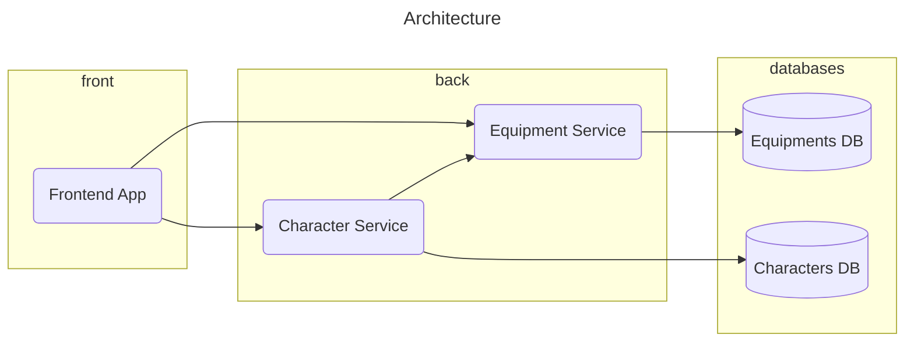

# [Educative Game Project] - Root

This project serves as an educational example of component based architecture.

## Table of Contents

- [Project Overview](#project-overview)
- [Prerequisites](#prerequisites)
- [Getting Started](#getting-started)

## Project Overview

This project is designed to demonstrate how to use images from repositories and run them together.

It uses other projects:
- The [Equipment Service](https://github.com/UPHF-Components-Courses/equipment-service) that exposes equipments
- The [Character Service](https://github.com/UPHF-Components-Courses/character-service) that exposes characters
- The [frontend application](https://github.com/UPHF-Components-Courses/educative-game-project-frontend)



## Prerequisites

Before you begin, ensure you have met the following requirements:

- Docker & Docker Compose
- Your favorite IDE or code editor

## Getting Started

1. Clone this repository:

```bash
$ git clone git@github.com:UPHF-Components-Courses/educative-game-project-root.git
```

2. Run the docker compose file

```bash
$ docker-compose up
```
